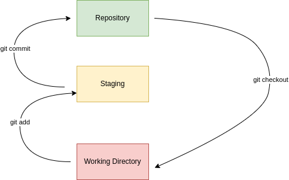

# git-notes

### **configure git**:
---
- there are three differnet levels in which the configs for git can be managed they are system,user and project level.

- this can be controlled by  providing a `--system` for system wide configurations and `--global` for user specific configurations or not provinding a flag all together from within the root of the repository for project specific configurations.

- In case of project specific configurations the configurations get writern to `.git/config` of the repo.

#### **Set user name:**
- this user name shows up in commits and pull requests

```
git config [--system,--global] user.name USER_NAME
```
#### **Set email address:**
- This email address shows up in commits and pull requrests
```
git config [--system,--global] user.email EMAIL_ADDRESS
```

#### **Set the editor:**
- This setting tells which editor to open when writing a commit message Ex: during a merge

```
git config [--system,--global] core.editor EDITOR_NAME
```

#### **Turn on color mode:**
- Setting this to true adds color to the o/p of various git commands Ex: the git logs

```
git config [--system,--global] color.ui true
```
#### **List all configurations:**

```
git config [--system,--global] --list
```
---

### **Turning on the auto complete feature:**

Head over to the git repository for git [git](https://github.com/git/git) and navigate to `contrib/completion` and download `git-completion.bash` to your computer , make an entry in your `.bashrc` so that the file is sourced  when your shell starts.

---

### **Viewing the git logs:**
- The git logs contains the commit history of the repository. The git log command can be used to explore it

#### **view only last n commits**

```
git log -NUMBER_OF_COMMITS_TO_SHOW
```
example: `git log -3` will show information about the last three commits

#### **View commits made by a particular author:**

```
git log --author=AUTHOR_NAME
```

#### **View commits between a given time range:**
```
git log --since=START_DATE --until=END_DATE
```
**NOTE**: The date should be in `yyyy-mm-dd` format.

#### **View commits which matches a given regex:**
```
git log --grep=REGEX
```

#### **View the contents which changed in this commit:**
```
git log -p
```
#### **View only the commits associated with a given file:**
```
git log FILE_NAME
```

#### **View only the commit ids and a short description:**
```
git log --oneline
```

#### **View the commits represented as a graph:**
```
git log --graph
```

**NOTE**: The `--no-pager` global option can be added to prevent git from piping its output to `less` by default.

#### **View the contents of a specific commit:**
```
git show COMMIT_SHA
```
---
### **Using git diff:**
- `git diff` can be be used to find what changed between two commits , it can also be used to get the difference between two branches.

#### **Get the difference between two commits:**
```
git diff COMMIT_ONE..COMMIT_TWO
```

**NOTE**: different commits can be accessed in refrence to a given commit by adding the `^` sign at the end of the commit or by using the `~NUMBER_OF_COMMITS_TO_MOVE_DOWNWORDS` syntax , it sould also be noted that the commit which refers to the tip of a branch can be accessed using the `HEAD` keyword.

**EXAMPLE**: given a commit hash `commitOne` then `commitOne^` refers to the parent of `commitOne` and `commitOne^^` refers to the grant parent of `commitOne` the same can be achived using the `~` sytax as well, in which the grant parent is referenced by `commitOne~2`.

#### **Get the difference between two branches:**
```
git diff BRANCH_ONE..BRANCH_TWO
```

**NOTE**: use the `--color-words` flag to get information about what exactly changed on each line.

#### **Get the difference between working directory and repository:**
```
git diff
```
#### **Get the difference between staging and repository:**
```
git diff --staged
```

---

### **The three tree architecture:**



- the `working directory` contains unstaged changes and untracked files , git wont track the changes in the `working directory`.

- the `staging` area contains changes which are ready to be commited , the advantage of having a staging area is that one can edit multiple files and then only move specific files to the `staging` area which will then be commited.

- the `repository` tree contains the actual commits , git maintains data integrity in this tree by tracking a chain of commits(*the commit hash of the previous commit is used in the generation of the commit hash of the next commit, so modifying an existing commit breaks the link to the next commit, however we can undo a commit by using `git revert` to create a new commit which negates the changes of an existing commit*).

#### **Moving changes from working directory to staging:**

##### **adding a file:**
```
git add FILE_NAME
```
##### **add everything from current directory:**
```
git add .
```
##### **removing a file:**
```
git rm FILE_NAME
```
##### **renaming a file:**
```
git mv OLD_FILE_NAME NEW_FILE_NAME
```

#### **Moving changes from staging to repository:**
```
git commit -m COMMIT_MESSAGE
```
#### **Using the git reset command:**
##### **Move the changes contained in the last commit back to staging area:**
```
git reset --soft HEAD^
```
##### **Move the changes contained in the last commit back to the working directory:**
```
git reset --mixed HEAD^
```

##### **Remove changes contained in the last commit:**
```
git reset --hard HEAD^
```

##### **Move changes in a file from staging to working directory:**
```
git reset --mixed HEAD
```
##### **Remove all changes in working directory:**
```
git reset --hard HEAD
```
##### **Remove changes in a specific file from working directory:**
```
git checkout HEAD -- FILE_NAME
```

##### **Remove untracked files**
```
git clean -f
```
##### **Recursively remove untracked files and directories:**
```
git clean -fd
```
**NOTE**: the `-n` flag can be used to get a list of files which will be removed,this can be run initially to make sure we are not removing something important.

---

### **Branches:**

Branches are very usefull when multiple people work ond different features in the same repository simultaniously,the typical flow would be like `create feature branch from master` -> `do feature development` -> `merge feature branch with master`

#### **create and switch to a new branch:**
```
git checkout -b FEATURE_BRANCH_NAME
```
#### **rename a branch:**
```
git checkout THE_BRANCH_TO_BE_RENAMED

git branch -M NEW_NAME
```
#### **Delete a branch:**
```
git branch -d BRANCH_NAME
```
#### **Merge two branches:**
```
git checkout DESTINATION_BRANCH

git merge SOURCE_BRANCH
```

---
